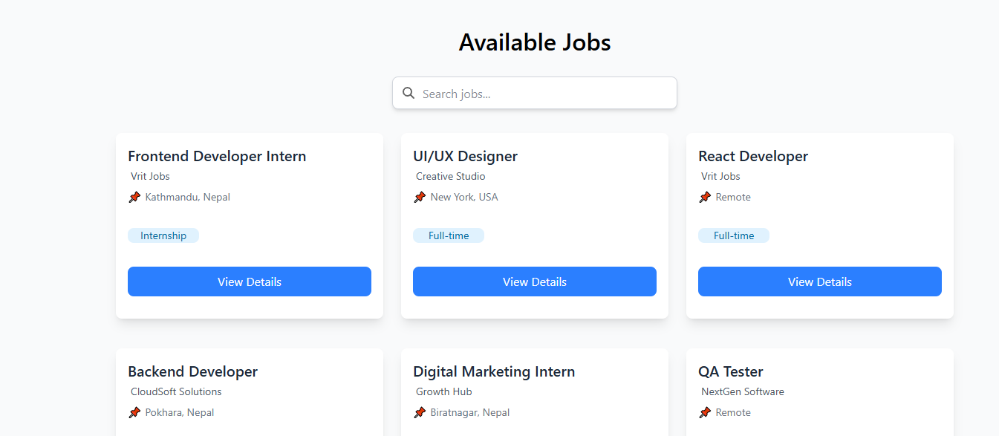
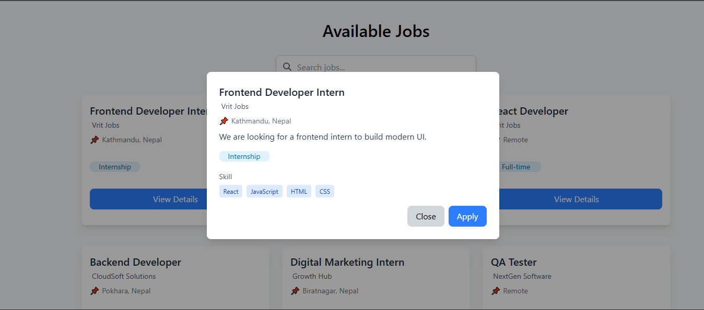
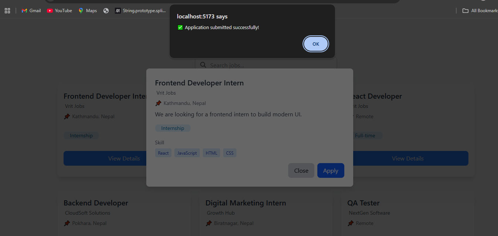

# 💼 Job Portal

A modern, responsive job portal application built with React and Vite. Browse available jobs, search by title, and apply with an elegant user interface.



---

## ✨ Features

- 🔍 **Smart Search** - Search jobs by title in real-time
- 📱 **Responsive Design** - Works seamlessly on all devices
- 💳 **Job Cards** - Clean, interactive job listing cards with hover effects
- 📄 **Job Details Modal** - View complete job information in a modal popup
- 🎨 **Modern UI** - Beautiful design with Tailwind CSS
- ⚡ **Fast Performance** - Built with Vite for optimal speed
- 📤 **Easy Apply** - One-click job application functionality

---

## 🖼️ Screenshots

### Home Screen


### View Job Details


### Apply for Job


---

## 🛠️ Tech Stack

- **Frontend:** React 19
- **Build Tool:** Vite
- **Styling:** Tailwind CSS
- **Deployment:** GitHub Pages
- **State Management:** React Hooks (useState)

---

## 📦 Installation & Setup

### Prerequisites
- Node.js (v16 or higher)
- npm or yarn

### Clone the Repository
```bash
git clone https://github.com/MohanBahadurSaud/Job-Portal.git
cd Job-Portal
```

### Install Dependencies
```bash
npm install
```

### Run Development Server
```bash
npm run dev
```
The app will be available at `http://localhost:5173`

### Build for Production
```bash
npm run build
```

### Preview Production Build
```bash
npm run preview
```

---

## 🚀 Usage

1. **Search Jobs** - Type in the search bar to filter jobs by title
2. **View Details** - Click the "View Details" button on any job card
3. **View Full Information** - See the complete job description, skills required, and job type
4. **Apply** - Click the "Apply" button in the modal to submit your application

---

## 📂 Project Structure

```
Job-Portal/
├── src/
│   ├── component/
│   │   ├── Button.jsx
│   │   ├── JobCard.jsx
│   │   ├── JobDetailsModal.jsx
│   │   └── JobList.jsx
│   ├── data/
│   │   └── jobs.js
│   ├── assets/
│   ├── App.jsx
│   ├── App.css
│   ├── index.css
│   └── main.jsx
├── public/
│   ├── FirstLook.png
│   ├── afterClickonViewButton.png
│   └── afterClickonApplyButton.png
├── vite.config.js
├── eslint.config.js
├── package.json
└── README.md
```

---

## 🎯 Components Overview

- **App** - Main application component with search functionality
- **JobList** - Displays filtered list of jobs based on search query
- **JobCard** - Individual job listing card with hover effects
- **JobDetailsModal** - Modal for viewing complete job details
- **Button** - Reusable button component

---

## 🌐 Deployment

This project is deployed to GitHub Pages. To deploy your own version:

```bash
npm run deploy
```

Visit the live demo: [Job Portal](https://MohanBahadurSaud.github.io/Job-Portal/)

---

## 📋 Available Scripts

| Command | Description |
|---------|-------------|
| `npm run dev` | Start the development server |
| `npm run build` | Build the project for production |
| `npm run preview` | Preview the production build |
| `npm run lint` | Run ESLint to check code quality |
| `npm run deploy` | Deploy to GitHub Pages |

---

## 🔧 Recent Bug Fixes

- ✅ Fixed modal flickering and size issues by rendering with React Portal
- ✅ Resolved CSS transform stacking context affecting modal positioning
- ✅ Improved modal width for better responsiveness

---

## 💡 Future Enhancements

- User authentication and profile management
- Save favorite jobs
- Application history tracking
- Filter by job type, location, and skills
- Backend integration for real job data
- Email notifications for job matches

---

## 🤝 Contributing

Contributions are welcome! Feel free to fork this repository and submit a pull request with your improvements.

---

## 📄 License

This project is open source and available under the MIT License.

---

## 👨‍💻 Author

**Mohan Bahadur Saud**
- GitHub: [@MohanBahadurSaud](https://github.com/MohanBahadurSaud)

---

## ⭐ Show Your Support

If you found this project helpful, please give it a ⭐ on GitHub!

---

*Last Updated: February 2026*
